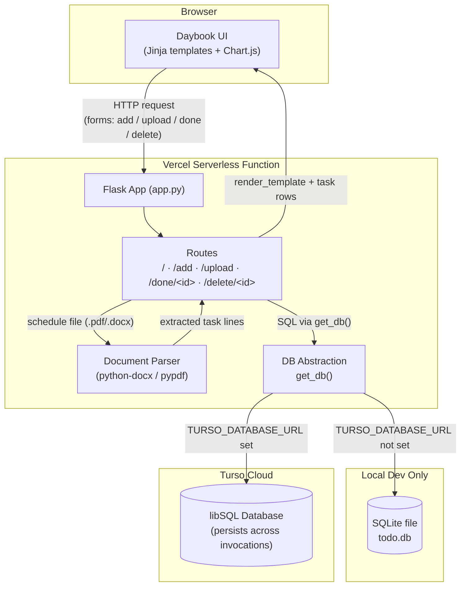
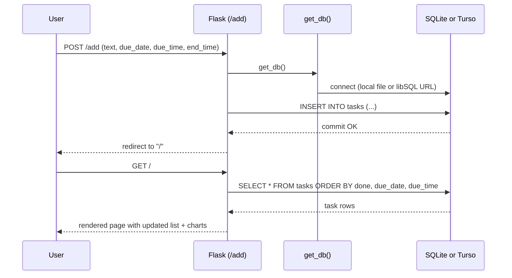

<p align="center">
  
</p>

# Daybook — Personal Task Tracker

Daybook is a lightweight Flask web app for managing daily tasks. You can add tasks by hand, or upload a schedule document (`.pdf` / `.docx`) and have each line automatically turned into a task. Tasks support an exact scheduled time window (start–end), live progress charts, and a Turso (libSQL)-backed database for real persistence when deployed on serverless platforms like Vercel.

---

## Table of contents

- [Features](#features)
- [Tech stack](#tech-stack)
- [System architecture](#system-architecture)
- [Database schema](#database-schema)
- [Routes](#routes)
- [Project structure](#project-structure)
- [Getting started](#getting-started)
- [Environment variables](#environment-variables)
- [Deploying to Vercel](#deploying-to-vercel)
- [Roadmap](#roadmap)

---

## Features

- **Add tasks manually** — text, due date, and an optional start–end time window (e.g. `09:00–10:30`)
- **Bulk import from documents** — upload a `.pdf` or `.docx` schedule; each non-empty line becomes its own task (list markers like `1.`, `-`, `•` are stripped automatically)
- **Mark done / undo, delete** — one click each, no page reload logic needed beyond a redirect
- **Live progress visualization** — an overall doughnut + bar chart (Chart.js) showing done vs. pending, plus a small per-task status pie (spinning while pending, solid when done)
- **Celebration micro-interaction** — completing a task triggers a toast + confetti burst
- **Pluggable persistence** — SQLite locally, or Turso (libSQL) in production, selected automatically based on environment variables
- **Vercel-ready** — designed around Vercel's serverless constraints (read-only filesystem except `/tmp`)

---

## Tech stack

| Layer | Choice |
|---|---|
| Backend | Flask (Python) |
| Templates | Jinja2 |
| Database | SQLite (local dev) / Turso libSQL (production) |
| Document parsing | `python-docx`, `pypdf` |
| Charts | Chart.js (CDN) |
| Fonts | Fraunces, Inter, JetBrains Mono (Google Fonts) |
| Hosting | Vercel (serverless functions) |

---

## System architecture



**Why two database backends?** Vercel's deployment filesystem is read-only except for `/tmp`, and each serverless invocation may start with a *fresh* `/tmp` — so a local SQLite file does not persist across requests in production. `get_db()` checks for `TURSO_DATABASE_URL`: if it's set, every request talks to a real Turso (libSQL) database over the network; if not, it falls back to a local SQLite file, which is perfectly fine for local development.

### Request flow (adding a task)



---

## Database schema

Single table, auto-created and auto-migrated on startup (`init_db()`):

```sql
CREATE TABLE IF NOT EXISTS tasks (
    id         INTEGER PRIMARY KEY AUTOINCREMENT,
    text       TEXT NOT NULL,
    due_date   TEXT NOT NULL,   -- ISO date, e.g. 2026-07-19
    due_time   TEXT,            -- optional start time, e.g. 09:00
    end_time   TEXT,            -- optional end time, e.g. 10:30
    done       INTEGER NOT NULL DEFAULT 0
);
```

`init_db()` checks `PRAGMA table_info(tasks)` on every startup and runs `ALTER TABLE ... ADD COLUMN` for any column that's missing, so upgrading an older deployed database (e.g. one created before `end_time` existed) happens automatically — no manual migration step required.

---

## Routes

| Method | Path | Purpose |
|---|---|---|
| `GET` | `/` | Render the task list, stats, and charts |
| `POST` | `/add` | Add a single task (`text`, `due_date`, `due_time`, `end_time`) |
| `POST` | `/upload` | Upload a `.pdf`/`.docx` schedule; each line becomes a task |
| `POST` | `/done/<int:task_id>` | Toggle a task's done/pending state |
| `POST` | `/delete/<int:task_id>` | Delete a task |

---

## Project structure

```
.
├── app.py                  # Flask app: routes, DB layer, document parsing
├── templates/
│   └── index.html          # Single-page UI (forms, task list, charts, animations)
├── static/
│   └── chart.umd.js        # Chart.js bundle
├── requirements.txt
├── vercel.json              # Vercel deployment config
├── .vercelignore
└── todo.db                  # Local SQLite file (dev only — not used when Turso is configured)
```

---

## Getting started

```bash
git clone <your-repo-url>
cd daily-tracker
pip install -r requirements.txt
python app.py
```

The app runs at `http://localhost:5000` using a local `todo.db` SQLite file by default.

---

## Environment variables

| Variable | Required | Description |
|---|---|---|
| `TURSO_DATABASE_URL` | For production persistence | e.g. `libsql://your-db-name-yourorg.turso.io` |
| `TURSO_AUTH_TOKEN` | For production persistence | Auth token for the Turso database |
| `VERCEL` | Set automatically by Vercel | Used to detect the serverless environment and switch `DATA_DIR` to `/tmp` |

If `TURSO_DATABASE_URL` isn't set, the app transparently falls back to local SQLite — no code changes needed to switch between dev and prod.

---

## Deploying to Vercel

1. Push the repo to GitHub and import it into a new Vercel project.
2. In **Project Settings → Environment Variables**, add `TURSO_DATABASE_URL` and `TURSO_AUTH_TOKEN` for the Production environment.
3. Redeploy so the new environment variables take effect.
4. Confirm `requirements.txt` includes `libsql-experimental` — without it, the deployed function will crash on import.

---

## Roadmap

- [ ] Recurring tasks
- [ ] Multi-user auth (Turso supports per-user databases well for this)
- [ ] Calendar/week view in addition to the flat list
- [ ] Push/email reminders around `due_time`
